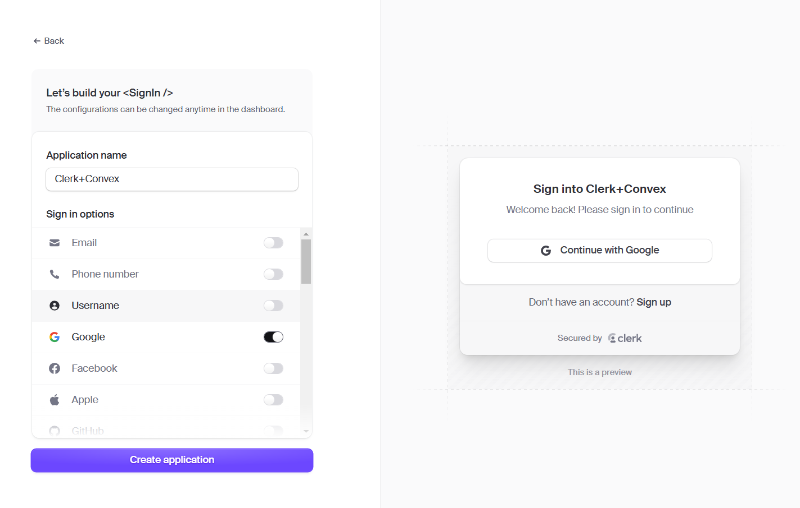
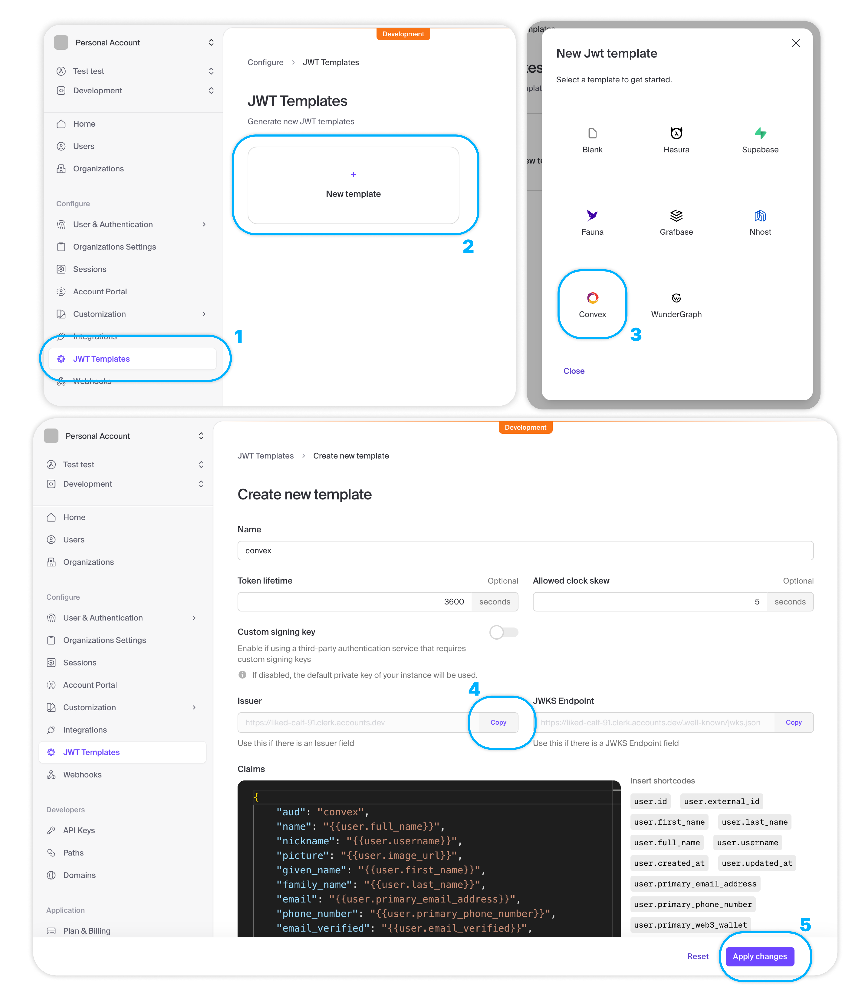
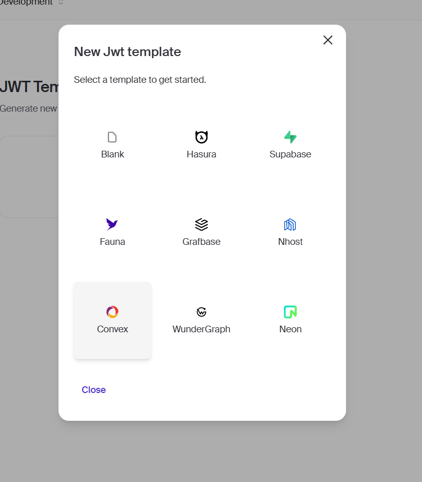

# Clerk + Convex Integration Guide

This guide walks you through setting up authentication using [Clerk](https://clerk.dev) and integrating it with [Convex](https://convex.dev) for backend functionalities.

[Demo](https://login-temps-two.vercel.app)
---

## Prerequisites

Ensure you have the following installed:
- Node.js
- npm or yarn

---

## Setup Instructions

### 1. **Create a Clerk Project**

- Go to the [Clerk dashboard](https://dashboard.clerk.dev).
- Create a new project and configure desired authentication options (e.g., email, Google, etc.).

### **Clerk Project Creation Example**



---

### 2. **Install Clerk SDK**

In your project directory, run:

```bash
npm install @clerk/nextjs
```

### 3. **Set Up Environment Variables**

Create a `.env.local` file in your project and add the following:

```bash
NEXT_PUBLIC_CLERK_PUBLISHABLE_KEY=YOUR_CLERK_PUBLISHABLE_KEY
CLERK_SECRET_KEY=YOUR_CLERK_SECRET_KEY
```

---

### 4. **Configure Middleware**

- Add a `middleware.ts` file in the appropriate directory (outside the `app` directory if you're using Next.js).

---

### 5. **Import Clerk Providers in `layout.tsx`**

Add the following code:

```typescript
import {
  ClerkProvider,
  SignInButton,
  SignedIn,
  SignedOut,
  UserButton,
} from "@clerk/nextjs";
import "./globals.css";

export default function RootLayout({
  children,
}: {
  children: React.ReactNode;
}) {
  return (
    <ClerkProvider>
      <html lang="en">
        <body>
          <SignedOut>
            <SignInButton />
          </SignedOut>
          <SignedIn>
            <UserButton />
          </SignedIn>
          {children}
        </body>
      </html>
    </ClerkProvider>
  );
}
```

---

### **Clerk Create JWT Template Example**



---

### 6. **Install Convex**

In a separate terminal, run:

```bash
npm install convex
npx convex dev
```

Choose or create a project in the terminal or through the Convex dashboard.

---

## Connecting Clerk with Convex

### 1. **Create a JWT Template**

- Navigate to **Configure > JWT Templates** in the Clerk dashboard.
- Select **New Template** and choose **Convex**.
- Name the template as `convex`.
- Copy the **Issuer Link** and click **Save**.

---

### **JWT Issuer Link Example**



---

### 2. **Set Environment Variables in Convex Dashboard**

Go to Convex Dashboard:
- **Project > Settings > Environment Variables**
- Add a variable:
  
  ```bash
  CLERK_WEBHOOK_SECRET=YOUR_SECRET_KEY
  ```

---

## Code Implementation

### 1. **Create `convex/auth-config.ts`**

```typescript
export default {
  providers: [
    {
      domain: process.env.CLERK_JWT_ISSUER,
      applicationID: "convex",
    },
  ],
};
```

---

### 2. **Set Up Webhooks**

- Go to **Clerk Dashboard > Configure > Webhooks**.
- Add a new webhook with the Convex **HTTP ACTION URL** from Convex settings.
- Subscribe to desired events (e.g., `user.created`, `user.updated`).
- Copy the **Signing Secret** and update Convex environment variables:

  ```bash
  CLERK_WEBHOOK_SECRET=YOUR_WEBHOOK_SECRET
  ```

---

## Database Schema

### Create `convex/schema.ts`:

```typescript
import { defineSchema, defineTable } from "convex/server";
import { v } from "convex/values";

export default defineSchema({
  users: defineTable({
    clerkId: v.string(),
    email: v.string(),
    password: v.optional(v.string()),
  })
  .index("by_clerkId", ["clerkId"])
  .index("by_email", ["email"])
});
```

---

## Environment Configuration

Ensure your `.env.local` has the following:

```bash
NEXT_PUBLIC_CLERK_PUBLISHABLE_KEY=YOUR_CLERK_PUBLISHABLE_KEY
CLERK_SECRET_KEY=YOUR_CLERK_SECRET_KEY

CONVEX_DEPLOYMENT=YOUR_DEPLOYMENT
NEXT_PUBLIC_CONVEX_URL=YOUR_CONVEX_URL

CLERK_JWT_ISSUER=YOUR_CLERK_JWT_ISSUER
CLERK_WEBHOOK_SECRET=YOUR_WEBHOOK_SECRET
```

---

## Deployment

- Use `npx convex dev` for local development.
- Deploy to your preferred environment when ready.

---

This guide provides a complete walkthrough for integrating Clerk and Convex for a streamlined and secure backend authentication solution.
